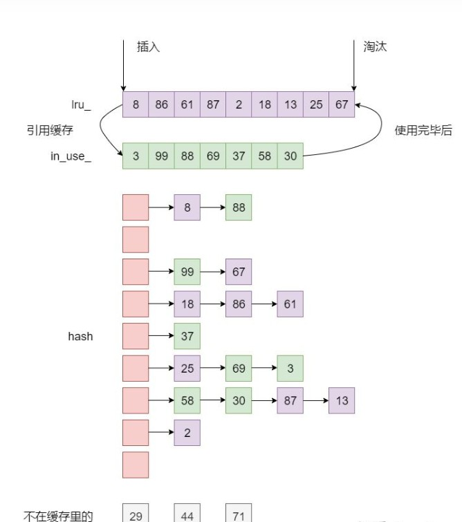

# LRU缓存

## leetcode146题目解题思路

LRU是一种缓存淘汰策略，全称是 Least Recently Used，也就是说最近使用过的数据是有用的，很久都没用过的数据是无用的，内存满了就优先删那些很久没用过的数据。

实现：采用双向链表+哈希表

·双向链表按照被使用的顺序存储了这些键值对，靠近头部的键值对是最近使用的，而靠近尾部的键值对是最久未使用的。

```c++
struct DLinkedNode {
    int key, value;
    DLinkedNode* prev;
    DLinkedNode* next;
    DLinkedNode() : key(0), value(0), prev(nullptr), next(nullptr) {}
    DLinkedNode(int _key, int _value) : key(_key), value(_value), prev(nullptr), next(nullptr) {}
};
```

·哈希表即为普通的哈希映射（HashMap），通过缓存数据的键映射到其在双向链表中的位置。

```c++
unordered_map<int, DLinkedNode*> cache;
```

我们首先使用哈希表进行定位，找出缓存项在双向链表中的位置，随后将其移动到双向链表的头部，即可在 O(1)的时间内完成 get 或者 put 操作。具体的方法如下：

```shell
·对于 get 操作，首先判断 key 是否存在：
	如果 key 不存在，则返回 -1；
	如果 key 存在，则 key 对应的节点是最近被使用的节点。通过哈希表定位到该节点在双向链表中的位置，并将其移动到双向链表的头部，最后返回该节点的值。
·对于 put 操作，首先判断 key 是否存在：
	如果 key 不存在，使用 key 和 value 创建一个新的节点，在双向链表的头部添加该节点，并将 key 和该节点添加进哈希表中。然后判断双向链表的节点数是否超出容		量，如果超出容量，则删除双向链表的尾部节点，并删除哈希表中对应的项；
	如果 key 存在，则与 get 操作类似，先通过哈希表定位，再将对应的节点的值更新为 value，并将该节点移到双向链表的头部。
```

```c++
class LRUCache {
private:
    unordered_map<int, DLinkedNode*> cache;
    DLinkedNode* head;
    DLinkedNode* tail;
    int size;
    int capacity;
};
```


## leveldb中的lrucache

前面leetcode比较简单，而leveldb中的lrucache相对稍微复杂一点，原理相差的不是很多，使用双向链表+哈希表来实现。

### part1.LRUHandle

leveldb中的双向链表，相比leetcode中增加了几个特有的属性，key的hash值、refs引用计数、next_hash哈希表中单向链表等。

```c++
struct LRUHandle
{
    // 存储的 value 对象的指针，可以存储任意类型的值
    void* value;
    //删除器。当refs == 0时，调用deleter完成value对象释放。
    void (*deleter)(const Slice&, void* value);
    // HashTable中使用：HashTable中的节点使用该字段进行串联链表
    LRUHandle* next_hash;
    // LRU 链表双向指针
    LRUHandle* next;
    LRUHandle* prev;
    size_t charge;      // 用户指定占用缓存的大小
    size_t key_length;  // key 的字节数
    bool in_cache;      // 是否在LRUCache in_use_ 链表
    uint32_t refs;      // 引用计数
    uint32_t hash;      // key()的哈希值; 用于快速分片和比较
    char key_data[1];

    Slice key() const {
        assert(next != this);
        return Slice(key_data, key_length);
    }
};
```

功能：

1.存储key:value数据对

2.lru链表，按照顺序标记least recently used.

3.HashTable bucket的链表

4.引用计数及清理

### part2.HashTable

leveldb中的哈希表，没有像leetcode中采用stl中的容器，而是手动实现了一个，底层数据结构使用的是指针数组，形成一个二维的形状，每一层是一个单向链表代表一个哈希桶，通过lruhandle结构中的next_hash链接起来。通过取key的hash值与层数-1做与运算来确定哪一层（list[hash & (length_ - 1)]）。向外提供插入、查找和删除方法。桶的个数初始化大小为4，随着元素增加动态修改。

```c++
class HashTable
{
public:
    LRUHandle* Lookup(const Slice& key, uint32_t hash);
    LRUHandle* Insert(LRUHandle* h);
    LRUHandle* Remove(const Slice& key, uint32_t hash);
private:
    LRUHandle** FindPointer(const Slice& key, uint32_t hash);
    void Resize();
private:
    // 指针数组的大小，即哈希桶的个数
    uint32_t length_;
    // 存储的 entry 总个数，当 elems > length 时，扩展 list 数组并重新 hash
    uint32_t elems_;
    // 存储 entry 的指针数组，每一层为一个哈希桶，初始大小为 4层，动态扩展，成倍增长
    LRUHandle** list_;
};
```

结构图：


核心函数：

```c++
LRUHandle** FindPointer(const Slice& key, uint32_t hash)
{
    // list_[hash & (length_ - 1)] 中存储着 next_hash 的地址
    // ptr 等于 next_hash 的地址
    // *ptr 等于其指向的 next_hash，即指向 next_hash 所连成的链表
    // **ptr 等于 next_hash 所指向的 LRUHandle，即指向具体的 entry

    // 定位到是哪个桶
    LRUHandle** ptr = &list_[hash & (length_ - 1)];
    while (*ptr != nullptr && ((*ptr)->hash != hash || key != (*ptr)->key()))
    {
        ptr = &(*ptr)->next_hash;
    }
    return ptr;
}
```

```shell
该接口的作用是返回 key&&hash 插入的合适位置，如果桶中不存在相同的key或者hash则返回nullptr，如果存在相同的key或者hash则返回之前的LRUHandle*，方便上层调整。
```

### part3.LRUCache

leveldb中的LRUCache结构相比于leetcode中的LRUCache实际上多了一个in_use_双向链表，它用来标记当前entry是否被用户使用。

```c++
class LRUCache
{
public:
    // 对外提供的接口和Cache.h头文件一致，只是多了一个额外的”hash“参数，用来个hashtable使用
    Cache::Handle* Insert(const Slice& key, uint32_t hash, void* value,
                        size_t charge,
                        void (*deleter)(const Slice& key, void* value));
    Cache::Handle* Lookup(const Slice& key, uint32_t hash);
    void Release(Cache::Handle* handle);
    void Erase(const Slice& key, uint32_t hash);
private:
    // 双向链表的节点的添加与删除
    void LRU_Remove(LRUHandle* e);
    void LRU_Append(LRUHandle* list, LRUHandle* e);
    // entry 引用计数的增加与减少
    void Ref(LRUHandle* e);
    void Unref(LRUHandle* e);
    bool FinishErase(LRUHandle* e);
private:
    // 缓存容量
    size_t capacity_;   
    // 互斥锁，保护下列数据
    mutable Mutex mutex_;
    // 当前lrucache已经使用的内存
    // usage_ 必须小于 capacity
    size_t usage_ ;
    
    // 缓存中的节点
    // lru.next 指向最旧的 entry，lru.prev 指向最新的 entry
    // 当缓存满了时，先从 lru.next 开始淘汰 entry
    // lru 保存 refs==1，并且 in_cache==true 的 entry
    LRUHandle lru_ ;

    // 当前正在被使用的缓存项链表
    // entries 被客户使用 并且 refs>=2 and in_cache==true
    LRUHandle in_use_ ;

    // 保存所有 entry 的哈希表，用于快速查找数据
    HandleTable table_ ;
};
```

重点方法介绍

```shell
1.insert
通过传入的key及value申请内存构造一个LRUHandle节点，然后插入hashtable中，这时有两种情况。
情况1，hashtable中无该节点直接插入；
情况2，hashtable中有相同key或hash的节点，则需要将旧节点从cache中删除（使用 FinishErase 方法），同时使该节点的引用计数减少操作及状态调整（使用 unref 方法）。

插入完成后，当前lruhandle节点的refs_=2,in_cache=true

注意：lru的清除不活跃数据的时机是在insert时，通过当前已使用的内存和总容量做判断。
```

```shell
2.lookup
从hashtable中查询到匹配的lruhandle，然后对该lruhandle进行引用计数增加及状态调整（使用 Ref 方法）。
```

```shell
3.release
加锁，使用 unref 方法使该节点的引用计数减少操作及状态调整。
该方法很重要，当调用insert、lookup操作完lruhandle时，节点的状态时refs>=2 && in_cache =true的，使用该方法将节点的refs减少避免内存泄漏。
```

```shell
4.erase
从hashtable中删除匹配的lruhandle节点，然后将该节点从cache中删除（使用 FinishErase 方法）
```

私有方法介绍

```shell
1.Ref
该接口的调用方为lookup查询时调用，将查询结果返回给调用方时需要对节点的内容做更新及在cache中的情况。
如果当前节点的refs==1 && in_cache==true，需要将其从原来的链表中删除也就是lru_，然后将其降入到in_use_链表中，引用计数++。
```

```shell
2.Unref
该接口的调用方为release及FinishErase或者lrucache析构函数调用。
主要负责对节点的引用计数-1操作，如果refs==0，调用用户的回调函数，如果refs==1&&in_cache==true，将其切换到lru_中.
```

```shell
3.FinishErase
该方法为从cache的hashtable中清除不需要的节点后也同步的将该节点信息从cache中删除，调用Unref.
```

整体结构图




```shell
entry的引用计数

可以参考这篇博客写的很详细
https://bbs.huaweicloud.com/blogs/251517
```


### part4.ShardedLRUCache

```shell
ShardedLRUCache 是 LevelDB 对外暴露的 LRUCache。
其中定义了 16 个 LRUCache，每次进行插入或者查找时，使用哈希值的最高四位判断当前应该在哪个 LRUCache 中查找，然后在找到的 LRUCache 中进行相应的操作。
```


