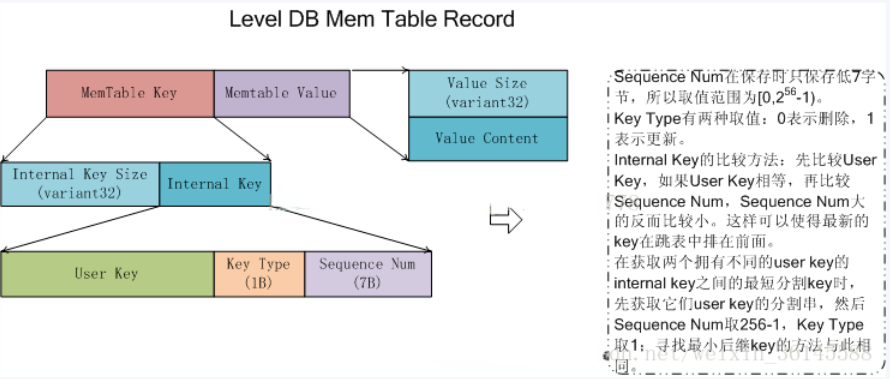
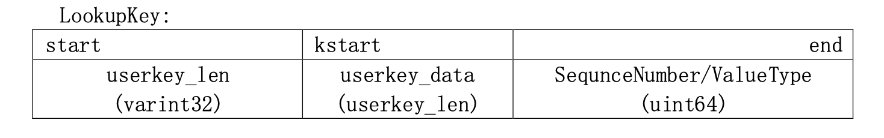

# 一、Memtable

## 1.用途

在Leveldb中，所有内存中的KV数据都存储在Memtable中，物理disk则存储在SSTable中。在系统运行过程中，如果Memtable中的数据占用内存到达指定值(Options.write_buffer_size)，则Leveldb就自动将Memtable转换为Memtable，并自动生成新的Memtable，也就是**Copy-On-Write机制**了。

Immutable Memtable则被新的线程Dump到磁盘中，Dump结束则该Immutable Memtable就可以释放了。因名知意，**Immutable Memtable是只读的**。

**所以可见，最新的数据都是存储在Memtable中的，Immutable Memtable和物理SSTable则是某个时点的数据。**

为了防止系统down机导致内存数据Memtable或者Immutable Memtable丢失，leveldb自然也**依赖于log机制来保证可靠性**了。

Memtable提供了写入KV记录，删除以及读取KV记录的接口，但是事实上**Memtable并不执行真正的删除操作,**删除某个Key的Value在Memtable内是作为插入一条记录实施的，但是会打上一个Key的删除标记，**真正的删除操作在后面的 Compaction过程中，lazy delete。**

## 2.核心数据结构是skiplist

Memtable中的**KV对是根据Key排序的**，leveldb在插入等操作时保证key的有序性。

这里的重点是skiplist 如何组织KV数据对的。

## 3.接口说明

```cpp
class MemTable {
 public:
  
  ...
      
  void Ref() { ++refs_; }
  void Unref() ;
  // 返回该 Memtable 非精确的内存使用量
  size_t ApproximateMemoryUsage();
  Iterator* NewIterator();
  void Add(SequenceNumber seq, ValueType type, const Slice& key,
           const Slice& value);
  bool Get(const LookupKey& key, std::string* value, Status* s);

 private:
  KeyComparator comparator_;    // key值比较模块，提供给skiplist
  int refs_;
  Arena arena_; // 内存分配模块，提供给skiplist
  Table table_;
};
```

### Ref&&Unref

Memtable是基于引用计数的机制，如果引用计数为0，则在Unref中删除自己，**Ref和Unref**就是干这个的。

### NewIterator

**NewIterator**是返回一个迭代器，可以遍历访问table的内部数据。

### Add&&Get

**Add和Get**是添加和获取记录的接口，没有Delete，memtable的delete实际上是插入一条type为kTypeDeletion的记录。

**Add**

先看第二部分(key的不同类型然后容易理解这里)

KV记录在skip list的**存储格式**等信息，首先总长度为：

```shell
VarInt(Internal Key size) len + internal key size + VarInt(value) len + value size
```

内存中的格式为

```shell
| VarInt(Internal Key size) len | internal key |VarInt(value) len |value|
```

其中internal key相关为：

```shell
internal key = |user key |sequence number |type |
Internal key size = key size + 8
```

**Get**

主要就是一个**Seek函数**，根据传入的LookupKey得到在memtable中存储的key，然后调用Skiplist::Iterator的Seek函数查找。Seek**直接调用**Skip list的FindGreaterOrEqual(key)接口，返回**大于等于key的Iterator**。然后取出user key判断时候和传入的user key相同，如果**相同**则**取出value**，如果记录的Value Type为kTypeDeletion，返回Status::NotFound(Slice())。

# 二、key的不同类型

leveldb有5个key



## 1.user_kry

用户层面传入的 key，使用 Slice 格式。

## 2.ParsedInternalKey && InternalKey (db/dbformat.h)

**ParsedInternalKey**

db 内部操作的 key。

未编码前，或者说是一个解码后的Internal Key结构，它由user_key、sequence和type三个字段组成。

```cpp
struct ParsedInternalKey {
	Slice user_key; 
  SequenceNumber sequence; 
  ValueType type;
};
```

**InternalKey**

db 内部，包装易用的结构

InternalKey的格式为：
User key (string) | sequence number (7 bytes) | value type (1 byte) 

把user key放到前面的原因是，这样对同一个user key的操作就可以按照sequence number顺序连续存放了，不同的user key是互不相干的。

```cpp
class InternalKey {
 private:
  std::string rep_;
 public:
  InternalKey(const Slice& user_key, SequenceNumber s, ValueType t);
  // 对rep_内容做操作get、update
  bool DecodeFrom(const Slice& s);
  Slice Encode() const;
  ...
};
```

**InternalKey和ParsedInternalKey**相互转换的两个函数

```cpp
// ParsedInternalKey ==> InternalKey
void AppendInternalKey(std::string* result, const ParsedInternalKey& key);
// InternalKey ==> ParsedInternalKey
bool ParseInternalKey(const Slice& internal_key, ParsedInternalKey* result);
```

**InternalKey提取出UserKey函数**

```cpp
// InternalKey ==> UserKey
inline Slice ExtractUserKey(const Slice& internal_key);
```

### 2.1.ValueType  (db/dbformat.h)

leveldb 更新(put/delete)某个 key 时不会操控到 db 中的数据，每次操作都是直接新插入一份 kv 数据，具体的数据合并和清除由后台的 compact 完成。所以，每次 put，db 中就会新加入一份 KV 数据， 即使该 key 已经存在;而 delete 等同于 put 空的 value。为了区分真实 kv 数据和删除操作的 mock 数据，使用 ValueType 来标识:

```cpp
enum ValueType { 
  kTypeDeletion = 0x0, 
  kTypeValue = 0x1
};
```

### 2.2.SequnceNnumber  (db/dbformat.h)

leveldb 中的每次更新(put/delete)操作都拥有一个版本，由 SequnceNumber 来标识，整个 db 有一个 全局值保存着当前使用到的 SequnceNumber。SequnceNumber 在 leveldb 有重要的地位，key 的排序， compact 以及 snapshot 都依赖于它。
typedef uint64_t SequenceNumber;

存储时，SequnceNumber 只占用 56 bits, ValueType 占用 8 bits，二者共同占用 64bits(uint64_t).

## 3.LookupKey & Memtable Key (db/dbformat.h)

Memtable_key是LookupKey的字符串版本，类型为slice

Memtable的查询接口传入的是LookupKey，它也是由User Key和Sequence Number组合而成的.

LookupKey的格式为：

Size (int32变长)| User key (string) | sequence number (7 bytes) | value type (1 byte)



```cpp
class LookupKey {
...
public:
  Slice memtable_key() const { return Slice(start_, end_ - start_); }
  Slice internal_key() const { return Slice(kstart_, end_ - kstart_); }
  Slice user_key() const { return Slice(kstart_, end_ - kstart_ - 8); }

private:
	const char* start_; 
  const char* kstart_; // 指向user_key开始的位置
  const char* end_;
};
```

其中**start_**是LookupKey字符串的开始，**end_**是结束，**kstart_**是start_+4，也就是user key字符串的起始地址。

对 memtable 进行 lookup 时使用 [start,end], 对 sstable lookup 时使用[kstart, end]。


# 三、Comparator

这里的comparator包括抽象类Comparator及其两个实现类：一个是内置的BytewiseComparatorImpl，另一个是InternalKeyComparator。

## 1.Comparator抽象类

Comparator只是导出了几个接口，高级方法是用来减少索引快等内部数据结构带来空间上的浪费，可以先不关注，重点关注下Compare方法及name即可。

```cpp
class Comparator {
 public:
  virtual ~Comparator();

  // Three-way comparison.  Returns value:
  //   < 0 iff "a" < "b",
  //   == 0 iff "a" == "b",
  //   > 0 iff "a" > "b"
  virtual int Compare(const Slice& a, const Slice& b) const = 0;

  // 比较器的名字，用来检查比较器能不能match上（比如数据库创建时使用的名字和后来使用的不一致）
  // 如果比较器实的实现改变了并且会造成任何多个key的相关顺序改变，那客户端就应该换一个新名字。
  // 以'level.'开头的名字被保留，客户端不要使用
  virtual const char* Name() const = 0;

  // 高级方法：它们用于减少索引块等内部数据结构的空间需求。
  // 如果*start < limit，改变*start变成一个短字符串[start,limit)
  virtual void FindShortestSeparator(std::string* start,
                                     const Slice& limit) const = 0;
  // 将*key变成一个比原*key大的短字符串，并赋值给*key返回。
  virtual void FindShortSuccessor(std::string* key) const = 0;
};
```

## 2.BytewiseComparatorImpl

BytewiseComparatorImpl是按字典逐字节序进行比较的，使用slice提供的compare比较，也就是说i>helloworld，因为先比较i和h，i>h，比较结束。

```cpp
class BytewiseComparatorImpl : public Comparator {
 public:
  const char* Name() const override { return "leveldb.BytewiseComparator"; }
  // 比较函数使用的是slice，字符串比较
  int Compare(const Slice& a, const Slice& b) const override {
    return a.compare(b);
  }
    
  // 找到start、limit之间最短的字符串，如“helloworld”和”hellozoomer”之间最短的key可以是”hellox”。
  void FindShortestSeparator(std::string* start,
                                     const Slice& limit) override;
  // 用于找到比key大的最短字符串，如传入“helloworld”，返回的key可能是“i”而已。
  void FindShortSuccessor(std::string* key) const override;
};
```

## 3.InternalKeyComparator

InternalKeyComparator是要重点关注的一个比较器，它用来比较内部键（Internal Key）。内部键值是为了方便处理，将原普通键、序列号和值类型组成的新键。

```cpp
class InternalKeyComparator : public Comparator {
 private:
  const Comparator* user_comparator_;

 public:
  explicit InternalKeyComparator(const Comparator* c) : user_comparator_(c) {}
  const char* Name() const override;
    
  int Compare(const Slice& a, const Slice& b) const override;
  int Compare(const InternalKey& a, const InternalKey& b) const;
  
  void FindShortestSeparator(std::string* start,
                             const Slice& limit) const override;
  void FindShortSuccessor(std::string* key) const override;

  const Comparator* user_comparator() const { return user_comparator_; }
};
```

**Compare**

比较方法有两个，一个是override，另一个是重载，重载参数为Internalkey，内部调用的仍然i为Slice参数的方法。

```shell
两个步骤
1).解析出 userkey 进行比较，如果user_key不相同，就直接返回比较结果，否则继续进行第二步
2).在user_key相同的情况下，比较sequence_numer|value type然后返回结果
```

**FindShortestSeparator**

**FindShortSuccessor**

该函数取出Internal Key中的user key字段，根据user指定的**comparator**找到并替换key，如果key被替换了，就用新的key更新**Internal Key**，并使用最大的**sequence number**。否则保持不变。