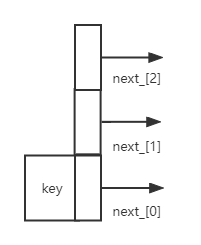

# skiplist

## 简介

LevelDB 中对 SkipList 的实现增加了多线程并发访问方面的优化的代码，提供以下保证：

Write：在修改跳表时，需要在用户代码侧加锁。
Read：在访问跳表（查找、遍历）时，只需保证跳表不被其他线程销毁即可，不必额外加锁。

也就是说，用户侧只需要处理写写冲突，LevelDB 跳表保证没有读写冲突。
这是因为在实现时，LevelDB 做了以下假设（Invariants）：

1.除非跳表被销毁，跳表节点只会增加而不会被删除，因为跳表对外根本不提供删除接口。
2.被插入到跳表中的节点，除了 next 指针其他域都是不可变的，并且只有插入操作会改变跳表。

## 类介绍

### 节点



```c++
template <typename Key, class Comparator>
struct SkipList<Key, Comparator>::Node
{
    explicit Node(const Key& k) : key(k) {}
    // 当前节点的Key值
    Key const key;

	// 横向获取每一层节点指向的下一个节点，通过n来切换不同层，n代表level
    Node* Next(int n)
    {
        assert(n >= 0);
        // 保证同线程中该 load 之后的对相关内存读写语句不会被重排到 load 之前
        // 并且其他线程中对同样内存用了 store release 都对其可见。
        return next_[n].load(std::memory_order_acquire);
    }
	// 横向设置每一层节点指向的下一个节点，通过n来切换不同层，n代表level
    void SetNext(int n, Node* x)
    {
        assert(n >= 0);
        // 保证同线程中该 store 之后的对相关内存的读写语句不会被重排到 store 之前
        // 并且该线程的所有修改对用了 load acquire 的其他线程都可见。
        next_[n].store(x, std::memory_order_release);
    }
    // 使用上稍有限制
    Node* NoBarrier_Next(int n)
    {
        assert(n >= 0);
        return next_[n].load(std::memory_order_relaxed);
    }
    void NoBarrier_SetNext(int n, Node* x)
    {
        assert(n >= 0);
        next_[n].store(x, std::memory_order_relaxed);
    }

private:
	// 作为Node的最后一个成员变量,由于Node通过placement new的方式构造，因此next_实际上是一个不定长的数组
	// 数组长度即该节点的高度,next_记录了该节点在所有层的后继节点，0是最底层链表
    std::atomic<Node*> next_[1];   
};

template <typename Key, class Comparator>
typename SkipList<Key, Comparator>::Node* SkipList<Key, Comparator>::NewNode(
    const Key& key, int height)
{
    // node数据结构的大小+（height-1）个所需存储的指向下一个Node的空间（每一层都需要指向下一个结点）
    char* const node_memory = arena_->AllocateAligned(
        sizeof(Node) + sizeof(std::atomic<Node*>) * (height - 1));
    return new (node_memory) Node(key); //使用new 的步骤2，placement new，来调用node的构造函数。
}
```

```shell
Node 中包含2组共4个成员方法和2个成员数据。
2个成员数据，key代表当前节点的key值，next_[1]是弹性数组的进一步变形，没有在编译期间确定数组大小而是直接给了数组大小为1，为最后一个元素，后面可以连接上多个std::atomic<Node*>的连续内存，可以通过next_[n]来访问。
4个方法均对next_[1]进行操作，功能为 获取当前节点指向的下一个节点 和 设置当前节点的下一个节点。其中前不带“NoBarrier”开头的方法为使用内存屏障，带“NoBarrier”开头的两个为不使用内存屏障，来达到不使用锁的方式来做到线程安全地操作资源。
```

```shell
NewNode方法
创建节点时使用Arena分派空间。Arena是LevelDB中的内存池。next_[1]，使用了柔性数组的特性，可以根据Node的高度不同，申请不同的空间。这里看到申请了一个Node大小的内存后，又在后面跟着申请了多个std::atomic<Node*>，因为Node结构体最后一个内容就是std::atomic<Node*>，所以这里连起来就可以通过Node中next_使用数组下标的方式来访问。
new (addr_ptr) Node(key) 该种方式为使用new的第二个步骤来调用node的构造函数。
```

### 迭代器

```cpp
// 跳表迭代器，用于遍历
class Iterator
{
    public:
    explicit Iterator(const SkipList* list);
    bool Valid() const;     // 是否指向了一个有效的节点
    const Key& key() const; // 返回指向当前节点的key
    void Next();            // 下一个节点
    void Prev();            // 前一个节点
    void Seek(const Key& target);   // 将node_调整到跳表第0层大于等于key的节点
    void SeekToFirst();             // 将node_调整到跳表第0层的头部节点
    void SeekToLast();              // 将node_调整到跳表第0层的尾部节点
    private:
    const SkipList* list_;
    Node* node_;    //当前指向的节点
};
```

```shell
该迭代器的作用是用于遍历level=0层的节点数据，初始化时需要传入一个跳表对象，node_指向第0层的节点，通过Next和Prev来移动node_，Seek为将node_移动到第0层>=key的节点位置，SeekToFrist和SeekToLast分别为将node_移动到第0层的头部和尾部。
```

```c++
使用demo
SkipList<Key, Comparator>::Iterator iter(&list);
iter.SeekToFirst();
while (iter.Valid()){
    printf("iterator key:%llu\n", iter.key());
    iter.Next();
}
```

### skiplist

```c++
template <typename Key, class Comparator>
class SkipList
{
private:
    // 跳表中的节点
    struct Node;

public:
    explicit SkipList(Comparator cmp, Arena* arena);
    SkipList(const SkipList&) = delete;
    SkipList& operator=(const SkipList&) = delete;
    
    // Insert key into the list. 插入前确保list中无要插入的key
    void Insert(const Key& key);
    // Returns true iff an entry that compares equal to key is in the list.
    bool Contains(const Key& key) const;
    // 跳表迭代器，用于遍历
    class Iterator;

private:
    enum { kMaxHeight = 12 };   // 可以增长到的最大高度
    inline int GetMaxHeight() const{
        return max_height_.load(std::memory_order_relaxed);
    }
    Node* NewNode(const Key& key, int height);
    // 高度随机增加，增加多少不确定
    int RandomHeight();
    // key值相等返回true
    bool Equal(const Key& a, const Key& b) const { return (compare_(a, b) == 0); }
    // Return true if key is greater than the data stored in "n"，不包括等于
    bool KeyIsAfterNode(const Key& key, Node* n) const;
    // prev参数说明：如果查找操作，则指定 prev = nullptr 即可；若要插入数据，则需传入一个合适尺寸的 prev 参数
    // 找到第0层大于等于key的节点，没有返回nullptr
    Node* FindGreaterOrEqual(const Key& key, Node** prev) const;
    // 返回跳表第0层最后一个小于key的节点
    Node* FindLessThan(const Key& key) const;
    // 返回跳表第0层的尾部节点
    Node* FindLast() const;

private:
    Comparator const compare_;      // 比较
    Arena* const arena_;            // Arena used for allocations of nodes
    Node* const head_;              // 头节点
    std::atomic<int> max_height_;   // 当前跳表最大高度
    Random rnd_;
};
```

```shell
LevelDB 的 SkipList 对外提供的接口主要有三个，分别是插入(Insert)、查询(Contains)和遍历(Iterator)，没有提供删除接口。
5个成员数据，compare_代表用户传入的比较类，里面提供了key的比较逻辑；arena_为节点分配内存的控制组件;head_为当前跳表的头结点；max_height_为当前跳表的最大高度；rnd_为随机模块，当插入一个节点时决定要不要增加一层通过它来确定。
2个对外的接口，插入和查询，Insert&Contains。
8个对内的方法
	1.GetMaxHeight 为获取当前跳表随着节点的插入已经增加到了第几层。
	2.NewNode 为插入时新建一个节点的方法，前面分析Node结构时介绍过。
	3.RandomHeight 跳表高度随机增加，作者的方法是得到一个随机值，如果随机值是 4 的倍数就返回 height，		否则 height 就加 1，这样每增加一层的概率就会减少，上帝视角来看上一层的节点数会比下一层的节点数要		少，查询效率会很高。
	4.Equal 利用用户提供的比较类来比较 节点的key 和 传入的key 是否相等。
	5.KeyIsAfterNode 利用用户提供的比较类来比较left是否大于right
	6.一组find方法，用于在当前跳表的第0层查找符合预期的node节点。
		6.1.FindGreaterOrEqual 找到第0层大于等于key的节点，没有返回nullptr，Insert方法使用到了第二			个参数用来记录level降级时的前一个节点，待插入的节点追加到这些层级节点的后一个节点，串联起来。
		6.2.FindLessThan 返回跳表第0层最后一个小于key的节点
		6.3.FindLast 返回跳表第0层的尾部节点
```

```shell
Insert介绍
	1.记录从最高层查找到第0层经过的节点，目的是插入新节点时依据这些节点进行串联链表
	2.不允许插入重复key，查询到重复的key，异常
	3.随机高度，如果随机height > 跳表当前最大高度max_height_，需要对 (height-max_height_)层进行初		始化,随机的level <= 最大高度无需处理
	4.创建新节点，然后对每一层的链表进行调整
```

```shell
Contains介绍
调用FindGreaterOrEqual 在第0层找到 >=key节点的位置，然后使用Equal比较节点和key是否相等，等于返回true，不等于返回false.
```


## 用户输入的Comparator比较类

```c++
demo
struct Comparator {
    int operator()(const Key& a, const Key& b) const {
        if (a < b) {
            return -1;
        }
        else if (a > b) {
            return +1;
        }
        else {
            return 0;
        }
    }
};
```

```shell
要求：
left=right return 0
left<right return -1
left>right return 1
```


## 线程安全

### std::atomic

```shell
简单概述为：atomic使用总会配合各种各样的memory order进行使用，memory order控制了执行结果在多核中的可见顺序，这个可见顺序与代码序不一定一致(第一句代码执行完成的结果不一定比第二句早提交到内存)，其一是进行汇编的进行了指令优化重排，其二是cpu实际执行时乱序执行以及部分cpu架构上没有做到内存强一致性(内存强一致性：可以简单的理解为，执行结果出现的顺序应该和指令顺序一样，不存在重排乱序),导致后面的代码执行完成的时候，前面的代码修改的内存却还没改变。
作用为：atomic中的memory order可以看成是把汇编(软件)和cpu(硬件)提供的指令进行封装来避免问题，隐藏了底层，它们的作用是对汇编上做重排干预和硬件上乱序执行干预和执行结果在多核的可见性的控制。

c++中的memory order
分为3类
·memory_order_seq_cst: 顺序一致性模型，这个是默认提供的最强的一致性模型。
·memory_order_release/acquire/consume: 提供release、acquire或者consume, release语意的一致性保障
·memory_order_relaxed: 提供松散一致性模型保障，不提供operation order保证。

leveldb中用到了这三种
std::memory_order_relaxed：不对重排做限制，只保证相关共享内存访问的原子性。
std::memory_order_acquire: 用在 load 时，保证同线程中该 load 之后的对相关内存读写语句不会被重排到 load 之前，并且其他线程中对同样内存用了 store release 都对其可见。
std::memory_order_release：用在 store 时，保证同线程中该 store 之后的对相关内存的读写语句不会被重排到 store 之前，并且该线程的所有修改对用了 load acquire 的其他线程都可见。
```


